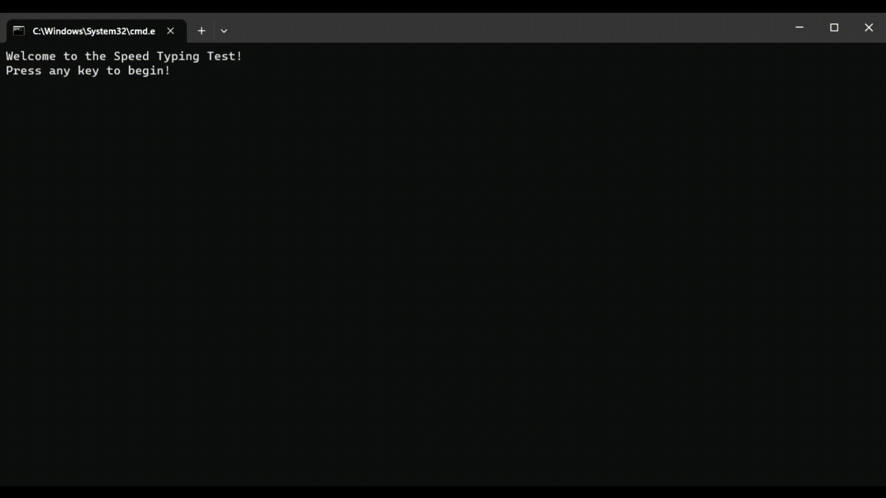

# Python Typing Test with Curses

This is a simple text-based typing test application created in Python using the `curses` library. It allows users to test their typing speed and accuracy by typing a randomly selected sentence.

## Features

- Randomly selects a sentence from a text file.
- Calculates and displays words per minute (WPM) in real-time.
- Highlights correct and incorrect keystrokes.
- Provides feedback on completion of the test.
- Supports quitting the test at any time by pressing the 'Esc' key.
